# The Bike Shed

## Strategy
The Bike Shed app is for cyclists who wish to keep a convenient collection of information about their bike/s and setup variables. The app allows users to create an account to login and store data securely before creating their bike or collection of bikes. Bikes can then be recalled for viewing, editing or deletion.

The intended user will be a cyclist who:
* Enjoys analysing data and fettling with their setup 
* Is looking to extract the most performance out of their bike/s
* Wants to record settings so they can easily be reverted back to if needed
* Wants to show their friends all the cool components on their bike 

The app will eventually also aim to connect riders via a ratings and selling platform.

The app is active and can be used [here](https://the-bike-shed-3d6351787c10.herokuapp.com/)

## Scope

### As a first time user I want:

* To have a convenient app to store data about my bikes
* To have a secure app to store sensitive data about my bikes such as a frame serial number or serial numbers for components
* To have sensitive information only visible to me 
* To intuitively understand how to use and navigate the app
* To easily add and remove bikes
* To easily add and remove and update components on those bikes
* To record settings for each of my bikes such as tyre pressures and suspension settings
* To input/upload service history

### As a returning user I want:

* To easily retrieve information about my bikes
* To easily retrieve settings for each bike
* To easily edit and otherwise manipulate information stored about my bikes
* To easily remove bike data 

## Features

### Sign Up/Sign In

  

Users will need to sign up and login to view their account and bike shed. User credential creation is controlled using form validation and passwords are hashed before being stored using Werkzeug.

After being successfully signed up users will be directed to the 'My Bike Shed' page to add their first bike.

### Navigation

All pages are accessible using the buttons within the app and these lead users through the app in an intuitive manner. For additional convenience, a sidenav is accessible from the top left burger menu which enables users to jump to any section quikly and easily.

### My Bike Shed

This is where users bikes are stored and accessed once created. From here users can refer to their bike spec, edit bikes and delete bikes entirely. 

Bikes are easily identifiable at a glance by the manufacturer and model name. This is accompanied by a small icon to the left depicting the bike category.

    Settings for bikes can be accessed through each bike from here. User can record settings such as tyre pressures, suspension settings etc. 
    Record serial numbers for components where applicable and link to product pages.
    Leave themselves notes for when they return to tuning setup or a specific location.
    Last serviced/service due date

### Add bike

 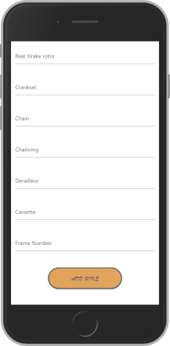

An add bike function which will allow users to create a new bike and add it to their bike shed. Users will be presented with a form to complete which will capture various components. For the sake of convenience, at the point of creation users will only be required to complete the manufacturer and model fields and will be able to return to the bike at any time to complete the remaining fields. As the app can store potentially sensitive data such as frame serial number it will be hidden to all but the creator. 

### My Profile

Stores data about the user such as username, name, email etc. As the rider weight is crucial to bike setup this can also be captured here. 

### Future Feature Implementations
* Upload image of bike
* Upload invoice of most recent service evidence
* Track service history
* Rate my ride - Enable users to view other users bikes and rate them
* Sell my bike/make me an offer - Users can sell or just make their bike available for offers if they're considering selling.
* Bike archive - bikes owned previously, date sold, how much for
* Choose if a bike is visible to other users
* Adjust app so that users bike form fields are entered into their own respective category databases on creation, building a collection of each category as they are created for example manufacturers, models etc.
* Polish look of app overall - The route functions and debugging plus customising Materialize took longer than I had anticipated and meant that I didnt get the app to look as good as originally planned.

## Structure

The data structure will be in the form of a NRDBS as this seems the most suitable data structure for this project.
The app structure will follow the flow of the creation process and intuitively guide the user through that process using prompts to gather information about users bikes.
Should an error occur an error page will display that will provide a link back home
The front-end will likely follow a tree structure but will experiment with nested lists, hub and spoke and dashboard.
Would be useful if certain options were saved after being created for example bike manufacturer once created by a user could be available for all users from a list, gradually creating a user generated list.

## Skeleton

## Surface
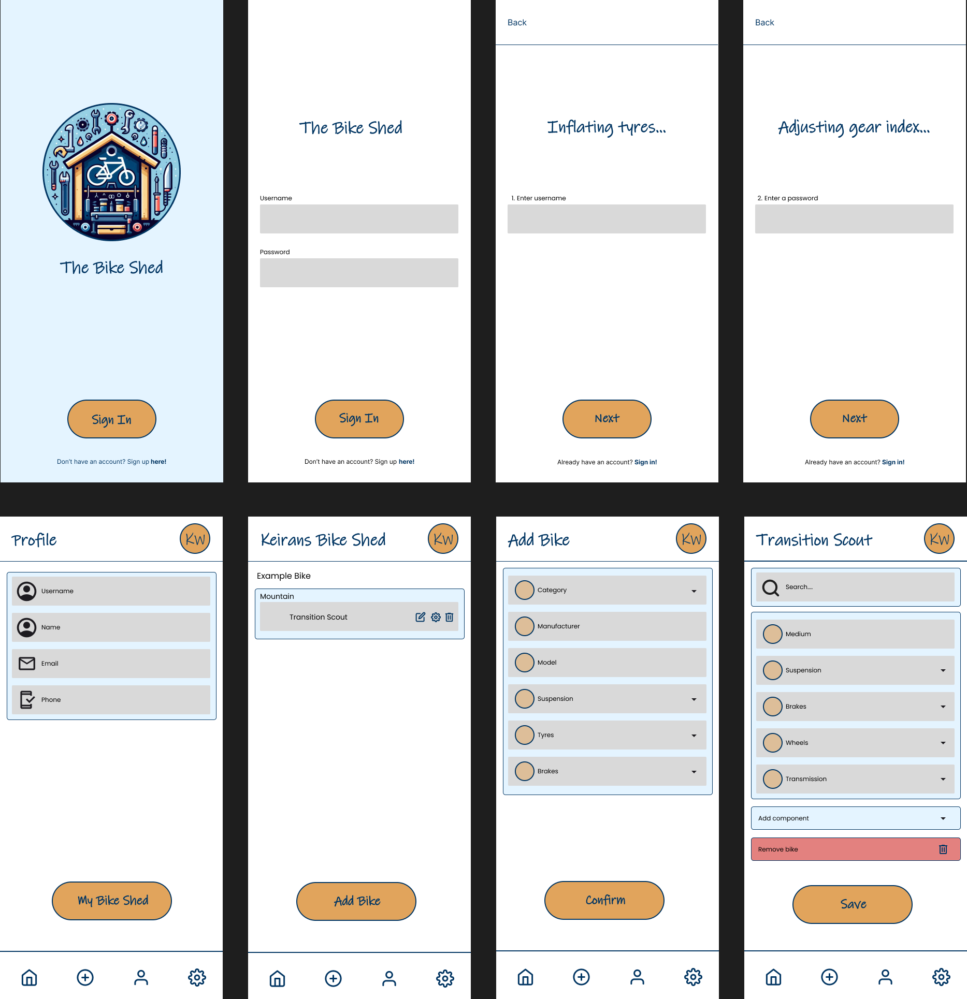

## Technologies

## Testing

### Lighthouse Results

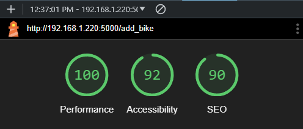 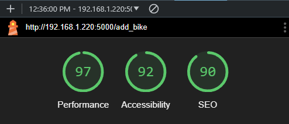

 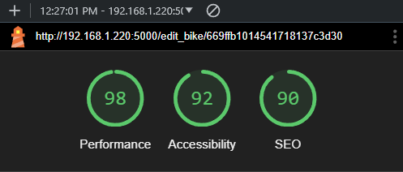

 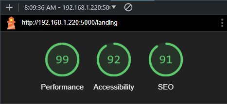

 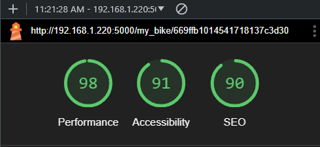

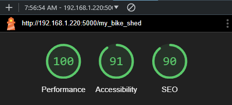 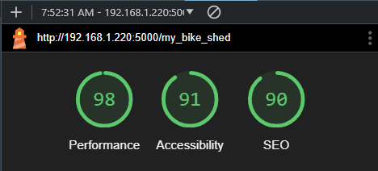

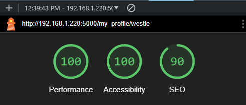 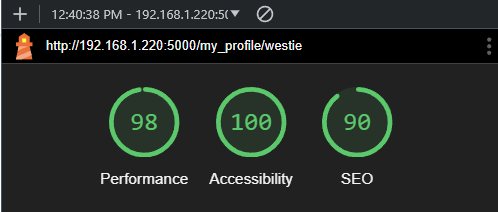

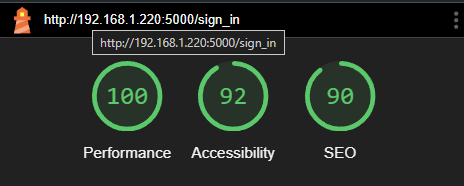 

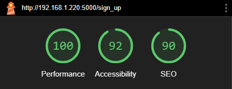 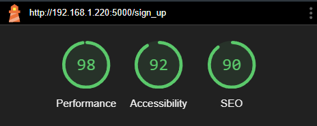

### Validator Results

 

 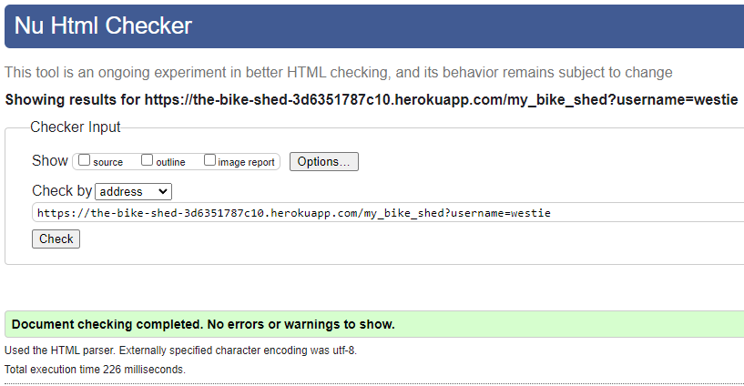

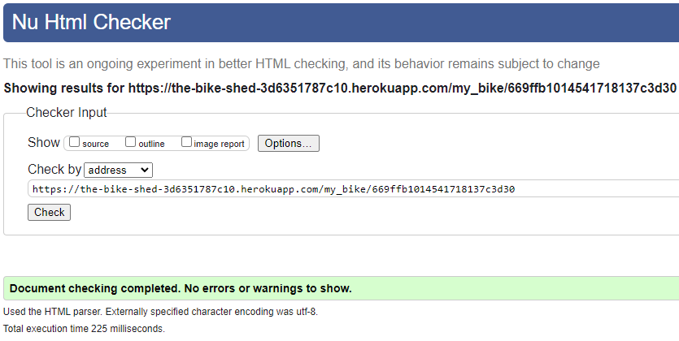 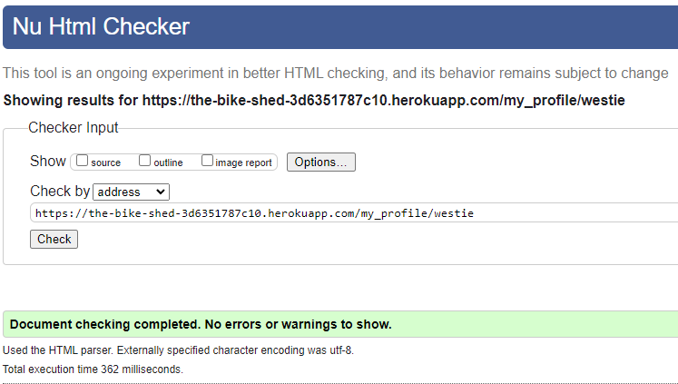

 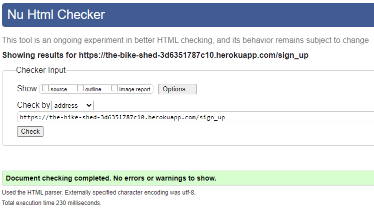

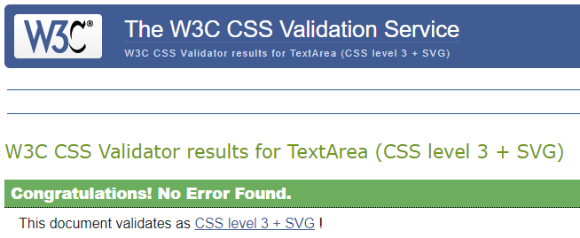

### Languages Used
* HTML
* CSS
* Python
* Jinja

### Frameworks and Libraries
* [Materialize](https://materializecss.com/about.html) by Google
* [MongoDB](https://www.mongodb.com/) by MongoDB Inc.
